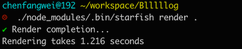

# Starfish
a blog render system, support `org-mode` and `markdown`.
also support custom renderer by write a plugin.

View [my blog](https://www.chencanhao.com/development/build-my-blog) for how build a blog website.



## Install
`npm install -g starfish-cli`or `yarn add -g starfish-cli`

## How to Use
### init
`starfish init`


### blog source structure
``` bash
├── articles
│   ├── Algorithm
│   │   └── boyer-moore.org
│   ├── Hardware
│   │   ├── build-home-nas
│   │   └── build-home-nas.md
├── config.yaml
├── Dockerfile
├── Jenkinsfile
├── nginx.conf
├── package.json
├── package-lock.json
├── README.md
└── @root-asset
    ├── aboutme.jpg
    ├── avatar.jpg
    ├── CNAME
    ├── favicon.ico
    ├── google7065849eb323b007.html
    └── robots.txt
```

### render
`starfish render [blog source path]`


### configure

`config.yml` example:

``` yaml
AUTHOR:
  NAME: 'test-reboot'
  GITHUB: 'reboot'

BLOG:
  ARTICLES_DIR: 'articles' # place where store articles
  DOMAIN: 'test.starfish.org' # expect blog domain
  HTTPS: false
  NAME: 'reboot blog'
  DESC: 'this is reboot bog'
  TMPDIR: '/tmp'
  TMPNAME: 'NobbBuildTemp'
  PORT: 8080
  HOST: '127.0.0.1'
  INDEX_ARTICLE_NUMBER: 7
  CATEGORY_ARTICLE_NUMBER: 20
  ALL_PAGE_ARTICLE_NUMBER: 20
  SORT_ARTICLE_BY: 'create'
  ARTICLE_SUMMARY_CHAR_NUMBER: 300
  IGNORE_CATEGORY_RENDER: false  # ignore category render

STYLE:
  THEMEDIR: '@themes'
  THEME: 'mock-theme'
  THEME_CONFIG_FILE: 'theme.config.yaml'

CONFIG:
  CONFIG_FILE: 'config.yaml'
  DIR_CONFIG_FILE: '.nobbbconfig.yaml'
  IGNORE_FILE: '.ignore'

SERVE:
  HOST: '0.0.0.0'
  PORT: '8080'

MAPPING:
  '@root-asset/*': '/'

LANG: 'zh-CN'

```
## Roadmap
- Offical Website
- Support deploy etc. command
- more offical theme